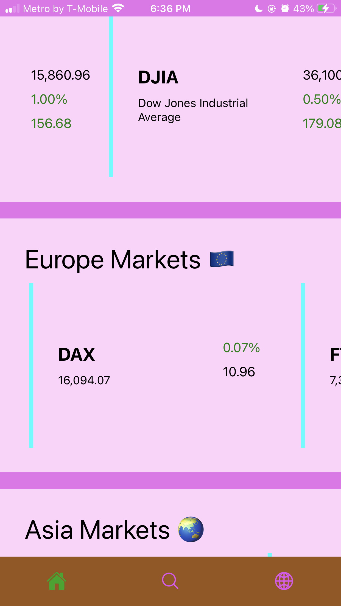
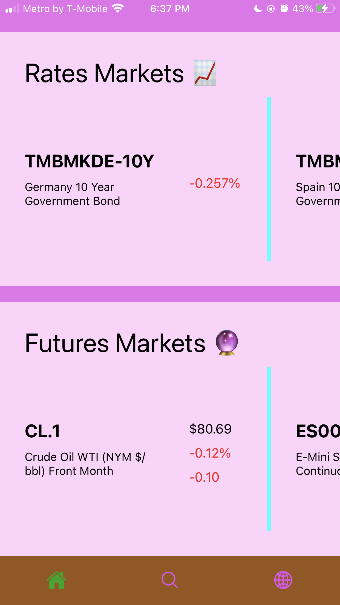
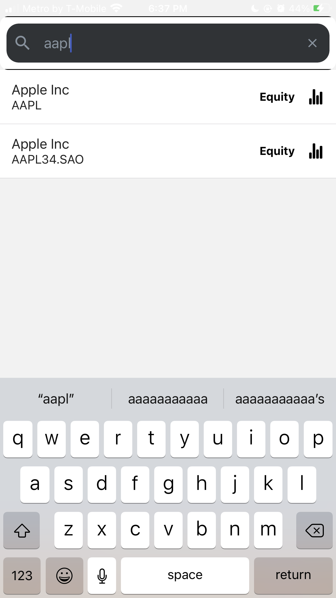
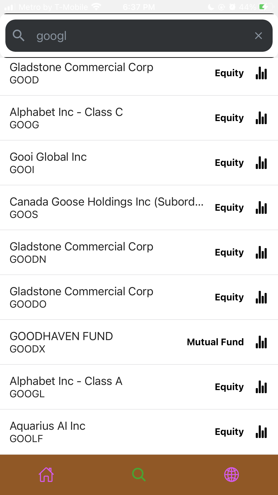
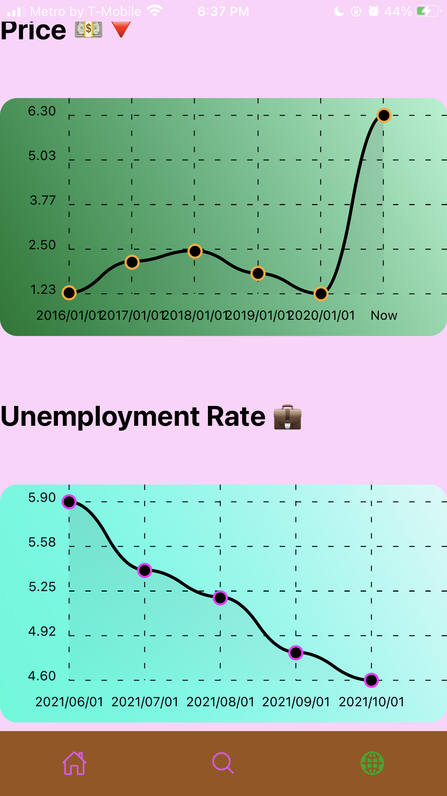
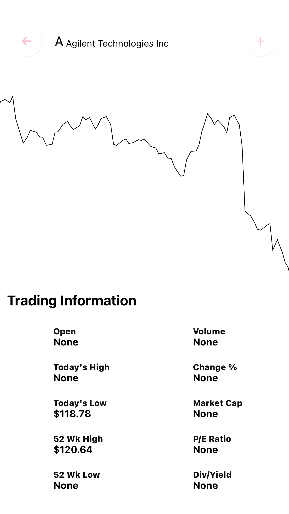

# Maid Marian

## Description 🔍

A light react native app where you can view general market data and also
search for a specific security.

## Screenshots 📸

      

## Running the app ⚙️

1. Find a server to host the backend.
2. Clone the repo and run `yarn install`
3. Add your server/alpha vantage api key
4. Enjoy

## Backend: [maid-marian-backend](https://github.com/prince-ao/maid-marian-backend)
